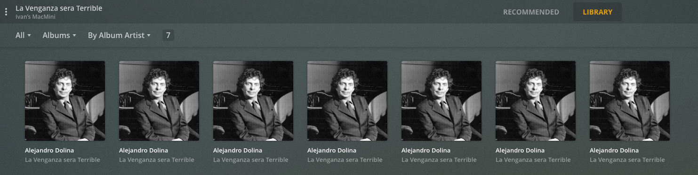

{}This is not a tutorial. Just a comment on my journey.{}

# About

I started a pet project this Holiday break. I setup a Plex media server at home to listen to a lot of audio files I have at home. Mainly a radio show from Argentina, called [La Venganza será Terrible](https://venganzasdelpasado.com.ar/) and the podcast [No Agenda](https://www.noagendashow.net/). Both shows have been on air for a long time and not every show is available online for download, so I download them whenever available and keep a local copy before they get lost in the ether.

## What is Plex?

[Plex](https://en.wikipedia.org/wiki/Plex_(software)) is a client–server media player system plus an ancillary software suite. The Plex Media Server desktop application runs on Windows, macOS, and Linux. The server desktop application organizes video, audio, and photos from a user's collections and from online services, enabling the players to access and stream the contents. There are official clients available for mobile devices, smart TVs, and streaming boxes, a web app, and Plex Home Theater (no longer maintained), as well as many third-party alternatives.

## But why?
Plex helps me keep all these files organized. I have always used two operating systems: some Linux flavor and MacOSX. On OSX I have used the iTunes environment but ever since it became decoupled into Movies, Podcasts and Music it has become too convoluted for my taste. On Linux I have used Songbird (no longer supported, what a pity).

Our family also uses both iOS and Android. Hence, I wanted a solution that allows me to listen to my files on both devices. Keep in mind, you need to pay 4.99 a month to run the mobile apps, which is worthwhile for me. This covers the cost of the mobile apps, not the media server which is open source.

For a more detailed reason why Plex might be a solution for you, click [here](https://www.tomsguide.com/reference/what-is-plex).  

## Ok.. how?
Setup was a breeze. You will find many videos out there explaining convoluted setups with NAS and whatnot. But that is not for me. My collection is small and now it is a pet project.

I basically refurbished an old MacMini I had lying around.

I upgraded the SSD and RAM; and I added the libraries to a physical hard drive.

All you need to do after is install the client on the machine and boom! Works out of the box.

Keep in mind that all these files are shared on the same network, i.e. at home. Sharing copyrighted files with other people outside of your network is [illegal](https://www.riaa.com/resources-learning/about-piracy/#:~:text=Copying%20CDs&text=The%20copy%20is%20made%20from,it%20to%20others%20for%20copying).

However if you own the files, say family home videos, Plex lets you share files with people outside of your local network.

## What to do next?
Install the client on whatever device you will be using to listen to these files. In our family, laptops, tablets and phones.

The UI is great, the app works fine with some minor glitches that are more than understandable. Files are organized beautifully, as well. Say for example, the files associated with La Venganza será Terrible look like this

## Follow my channel for more recipes
I don't know who might be interested, but this is the script I used to download the radio show from the web.

